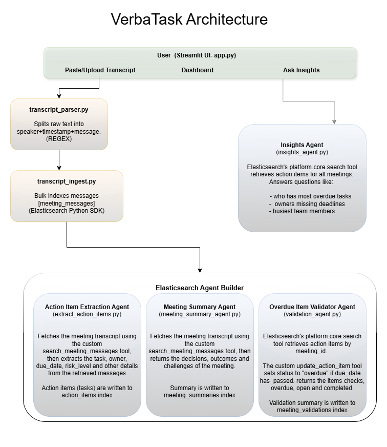

# VerbaTask: Multi-Agent AI for Meeting Action Tracking

VerbaTask turns raw meeting transcripts into structured, tracked action items automatically. It was built on Elasticsearch Agent Builder and runs a pipeline of four specialized agents at the moment a transcript is uploaded. It extracts the tasks, summarizes discussions, validates deadlines and answers questions across all your meetings.

---

## The Problem

Most meetings end with notes that are hard to keep track of. Project management tools are great for tracking tasks, but someone still has to manually create every ticket, assign owners, and set deadlines after the meeting. That process is slow, inconsistent, and unnecessarily manual. In a world where AI can automate complex workflows, manually transcribing action items from meetings is a problem worth solving. That's where VerbaTask comes in.

---

## The Solution

Paste or upload any meeting transcript. VerbaTask's agent pipeline automatically:

- Extracts every action item with owner, due date, and risk level
- Resolves relative dates like "tomorrow" or "next Friday" into absolute dates
- Summarizes the meeting with key decisions and roadblocks
- Validates completeness and flags overdue items
- Stores everything in Elasticsearch making the data ready to query, track, and act on

---

## Demo

Process a transcript -> agents run automatically -> dashboard updates in real time

1. Paste or upload a `.txt` meeting transcript
2. Hit **Process Transcript**. The full pipeline executes sequentially
3. Switch to the **Dashboard** to see extracted tasks with owners, due dates, and risk levels
4. Mark tasks complete, update due dates, or change risk levels. All values are autosaved to Elasticsearch
5. Click **Re-validate** to refresh overdue statuses and get an updated validation report
6. Ask Insight questions like "Who has the most overdue tasks?" or "Which meeting had the most action items?"

---

## Architecture



### Indexes

| Index | Description |
|-------|-------------|
| `meeting_messages` | Stores every parsed message from the transcript (meeting ID, speaker, text) |
| `action_items` | Stores action items extracted by the agent (meeting ID, task, owner, team, due_date, status, risk level, created at) |
| `meeting_summaries` | Stores the meeting summary generated by the Meeting Summary Agent |
| `meeting_validations` | Stores the validation report generated by the Overdue Item Validator Agent |

### Tools

VerbaTask runs a FastMCP server (`tools.py`) that exposes two MCP tools to the Kibana agents. The server runs locally and is exposed to Kibana via ngrok.

- **`create_action_item`**: Called by the Action Item Extraction Agent. Creates a new action item in the `action_items` index.
- **`update_action_item`**: Called by the Overdue Item Validator Agent. Updates the status of an existing action item.
- **`search_meeting_messages`**: Called by the Action Item Extraction Agent and the Meeting Summary Agent. Fetches all transcript messages for a given meeting ID from the `meeting_messages` index. Defined directly in the Elasticsearch platform.
- **`platform.core.search`**: Elasticsearch native tool. Called by the Insights Agent. Answers natural language questions across all meetings using ES|QL.

### Agents

VerbaTask uses four agents hosted on Elasticsearch Agent Builder. They run sequentially every time a transcript is processed. Instructions for creating each agent in Kibana can be found in the `agents/` folder.

**1. Action Item Extraction Agent**

Calls `search_meeting_messages` to fetch all transcript messages for the given `meeting_id`, then reads through them to identify every action item. For each one found, calls `create_action_item` to write a structured document to the `action_items` index with:

- Task description
- Owner
- Due date (relative dates like "tomorrow" resolved to absolute YYYY-MM-DD)
- Risk level
- Status (default: Open)
- Unique action_id
- Team
- Created at timestamp

**2. Meeting Summary Agent**

Generates a concise summary of the meeting covering key decisions, blockers, and outcomes. Saved to the `meeting_summaries` index and displayed on the dashboard per meeting.

**3. Overdue Item Validator Agent**

Reviews all action items for the meeting and flags any where the due date has strictly passed as Overdue using the `update_action_item` MCP tool. Saves a full validation report to the `meeting_validations` index. Can be re-run on demand using the revalidate button on the dashboard.

**4. Insights Agent**

Answers natural language questions across all meetings using ES|QL and semantic search via Elasticsearch's `platform.core.search` tool. Examples:
- "Who has the most overdue tasks?"
- "Which high-risk items are still open?"
- "Summarize what happened across all meetings"

---

## Dashboard Features

- **Metrics**: Displays counts of Meetings, Open, Overdue, Completed, and Completion Rate
- **Meeting selector**: Switch between meetings with a progress bar showing task completion
- **Task list**: Displays every action item with owner, due date, risk, and status
- **Date and Risk Level pickers**: Update due dates and risk levels directly from the dashboard, auto-saved to Elasticsearch
- **Completion checkboxes**: Mark tasks done with strikethrough styling
- **Re-validate Button**: Regenerates the validation report and updates overdue statuses
- **Meeting Summary**: Collapsible summary from the Meeting Summary Agent
- **Validation Report**: Collapsible report from the Overdue Item Validator Agent

---

## Tech Stack

| Layer | Technology |
|-------|------------|
| Agent Orchestration | Elasticsearch Agent Builder |
| MCP Server | Python + FastMCP |
| Backend | Python |
| Frontend | Streamlit |
| LLM | Anthropic Claude Sonnet (via Elastic Agent Builder) |
| Local Tunnel | ngrok |

---

## Project Structure

```
verbatask/
|---- src/
|     |---- app.py                     (Streamlit frontend)
|     |---- transcript_parser.py       (Parses transcripts)
|     |---- transcript_ingest.py       (Indexes messages into Elasticsearch)
|     |---- extract_action_items.py    (Calls Action Item Extraction Agent)
|     |---- meeting_summary_agent.py   (Calls Meeting Summary Agent)
|     |---- validation_agent.py        (Calls Overdue Item Validator Agent)
|     |---- insights_agent.py          (Calls Insights Agent)
|     |---- tools.py                   (MCP tools - FastMCP server)
|     |---- setup_indices.py           (Creates all ES indices on first run)
|---- docs/
|     |---- verbatask_architecture.png
      |---- VerbaTask Workflow.pdf
|---- agents/                          (Agent instructions for Kibana setup)
|---- tools/                           (Tool instructions for Kibana setup)
|---- sample_data/                     (Synthetic transcripts for testing)
|---- raw_data/                        (Uploaded raw transcripts saved here)
|---- parsed_data/                     (Parsed transcripts saved here)
|---- .env                             (Environment variables - fill in before running)
|---- requirements.txt
|---- README.md
```

---

## Setup

### 1. Clone the repo

```bash
git clone https://github.com/mahitayadla/Verbatask.git
cd verbatask
```

### 2. Install dependencies

```bash
pip install -r requirements.txt
```

### 3. Configure environment variables

Fill in your own credentials in the `.env` file placeholders before running the app.

### 4. Create Elasticsearch indices

```bash
python setup_indices.py
```

### 5. Create Agents

Create the four agents in Elasticsearch Agent Builder using the custom instructions in the `agents/` folder.

### 6. Create the search_meeting_messages tool

Create the `search_meeting_messages` tool in Elasticsearch Agent Builder using the instructions in the `tools/` folder.

### 7. Install ngrok and expose the MCP server

Download and install ngrok from https://ngrok.com

Then run:

```bash
python src/tools.py
```

In another terminal, expose it publicly:

```bash
ngrok http 8000
```

Copy the ngrok URL and add it as the MCP server URL in your Kibana Agent Builder tool settings.

```
https://your-ngrok-url.ngrok-free.app/mcp
```

### 8. Run the app

```bash
streamlit run src/app.py
```

---

## Sample Data

To test the pipeline without a real meeting, 10 synthetic transcripts covering different meeting topics are available in the `sample_data/` folder.

These were generated using LLMs with the following prompt:

> "Write a realistic workplace meeting transcript in WebVTT format with 8 speakers discussing [topic]. Keep the conversation natural, the way a real meeting would flow. Action items should come up organically through the dialogue, not labeled or called out explicitly. Medium length, around 2-3 minutes."

---

## Transcript Format

VerbaTask supports WEBVTT format, the common format used by meeting platforms like Zoom.

```
WEBVTT

1
00:00:01.000 --> 00:00:03.000
Alice: We need to finish the report by Friday.

2
00:00:04.000 --> 00:00:06.000
Bob: I'll have it ready by Thursday morning.
```

Plain text in `Speaker: message` format also works. To support a different format, update the regex pattern in `transcript_parser.py`.

---

## How It Works

### Transcript Parsing & Ingestion

When a user pastes or uploads a transcript and clicks **Process Transcript**, the app runs `transcript_parser.py`. The parser reads the WEBVTT text line by line and uses a regex pattern to extract the speaker and message text, converting it into structured message objects.

These messages are passed into `transcript_ingest.py` which indexes them into the `meeting_messages` ES index. Every transcript is grouped using a `meeting_id` generated from the current timestamp (`M_YYYYMMDD_HHMMSS`).

### Action Item Extraction

`app.py` calls `extract_action_items.py`, which sends a POST request to Kibana Agent Builder with the `meeting_id` and today's date. The agent fetches transcript messages using `search_meeting_messages`, identifies commitments, and calls `create_action_item` for each one found.

### Meeting Summarization

`meeting_summary_agent.py` calls the Meeting Summary Agent with the same `meeting_id`. The agent fetches the full transcript and generates a structured summary covering key decisions, discussion points, and blockers. Saved to `meeting_summaries` using the `meeting_id` as the document ID.

### Validation

`validation_agent.py` sends today's date in the prompt and instructs the agent to mark items as Overdue only if the due date is strictly before today. The agent calls `update_action_item` for anything past due, using `update_by_query` to locate items by `action_id`. The validation report is saved to `meeting_validations`.

### Dashboard

The dashboard fetches all action items and displays them in a real-time layout. Checkboxes, date pickers, and risk selectors all auto-save to Elasticsearch instantly.

### Overdue Status Management

The **Re-validate Meeting** button runs a direct `update_by_query` from Python to mark overdue items, then re-runs the Validation Agent to generate a fresh report. The new report replaces the previous one in `meeting_validations`.

### Insights

The **Ask Insights** page sends natural language questions to the Insights Agent, which uses `platform.core.search` to run ES|QL queries across all indices. Common questions are available as buttons that auto-fill the input field. Answers are stored in `st.session_state` to avoid unnecessary re-queries.

---

## References

- [Elastic AI Agent Builder — Context Engineering Introduction](https://www.elastic.co/search-labs/blog/elastic-ai-agent-builder-context-engineering-introduction)
- [Elastic Agent Builder Documentation](https://www.elastic.co/docs/explore-analyze/ai-features/elastic-agent-builder)
- [FastMCP Documentation](https://gofastmcp.com)
- [Streamlit Documentation](https://docs.streamlit.io)
- [ngrok Documentation](https://ngrok.com/docs)
- [Update by query API — Elasticsearch Documentation](https://www.elastic.co/docs/reference/elasticsearch/rest-apis/update-by-query-api)
- ChatGPT (OpenAI): Used to generate synthetic meeting transcripts
- Claude (Anthropic): Used to generate additional synthetic transcripts and assist with development


The PDF version of the project workflow and architecture is available in the `docs/` folder.
